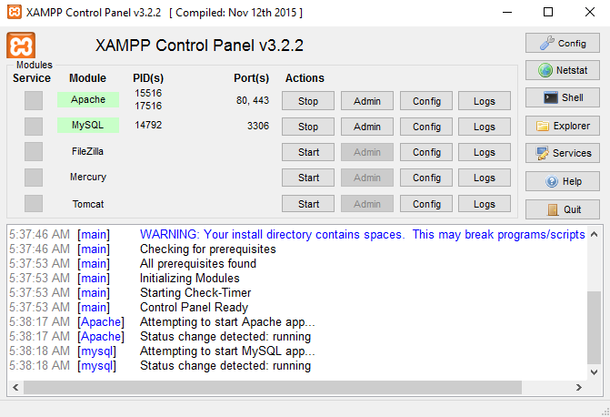

# Web Tabungan Siswa

Hallo Men Temen👋

Pada Tahun 2019 yang lalu, Saya telah membuat website pengeloaan tabungan bagi para guru dan siswa di sekolah yaitu <b>WEB TABUNGAN SISWA</b>

Tujuan dalam membuat website ini bagi saya mulanya hanya untuk memenuhi tugas yang diberikan oleh dosen Pemrograman Web sebagai tugas akhir di matakuliah tersebut dan disaat itu Kebetulan saya ditugaskan untuk membuat aplikasi tabungan. Namun supaya dapat digunakan bagi mereka yang perlu atau bahkan ingin memudahkan pengelolaan sistem tabungan di kelas. <i>That's Right</i>, Aplikasi ini sangat <i>Recommended</i> bagi mereka yang ingin mempercepat proses perhitungan tabungan dan pencatatan tabungan dengan memanfaatkan teknologi komputerisasii dalam bentuk sistem informasi berupa aplikasi <b>Web Tabungan Siswa</b>.

---

### Table of Content
- [Web Tabungan Siswa](#web-tabungan-siswa)
    - [Table of Content](#table-of-content)
  - [Deskripsi](#deskripsi)
  - [Demo Aplikasi](#demo-aplikasi)
  - [Cara Instalasi Aplikasi](#cara-instalasi-aplikasi)

---

## Deskripsi

Web Tabungan Siswa merupakan aplikasi buatan Novan Tiano yang dirancang untuk mereka yang bekerja dalam mengelola uang tabungan siswa terutama bagi para guru ataupun Tata Usaha Sekolah. Aplikasi ini dibangun dalam bentuk website server lokal, yang artinya aplikasi ini bisa dijalankan oleh kalian di komputer ataupun laptop tanpa perlu koneksi internet alias offline. Jadi, kalian bisa pasang aplikasinya di tempat server lokal kamu (aplikasi ini saya pasang di xampp).

Web Tabungan Siswa memiliki fitur yang dapat mempermudah penggunaan aplikasi ini diantaranya
1. Login - Memberikan izin pengunaan aplikasi yang telah teregisterasi di dalam sistem
2. Daftar/Sign in - Menyediakan pengguna baru dalam mendapatkan akun yang berfungsi untuk memberikan username dan password di login sehingga aplikasi dapat digunakan.
3. Home - Menyajikan informasi singkat mengenai fitur-fitur yang tersedia mulai dari data, transaksi, laporan dan tentang kami.
4. Data - Menyajikan tabel data petugas/admin dan data Nasabah aplikasi yang telah terdaftar.
5. Transaksi - Memproses transaksi nasabah bisa dalam bentuk penarikan atau penyetoran. petugas tinggal menginput nomor rekening lalu sistem akan mendeteksi, bila berhasil maka masukan nilai yang disetor/ditarik
6. Laporan - menyajikan tabel transaksi dalam kurun perbulan yang hasilnya akan dalam berbetuk ekstensi pdf.

---

## Demo Aplikasi

Anda bisa mencoba aplikasi sebelum menginstallnya di komputer kalian dengan klik link bawah sini

Untuk Login
- Username : novan09082000
- Password : N0v4n123.

👉 [Link Web Tabungan Siswa](https://tabungansiswa46.000webhostapp.com/) 👈

<video width="720" height="360" controls poster="Web.jpg">
  <source src="test.mp4" type="video/mp4">
</video>

---

## Cara Instalasi Aplikasi

1. Sebelum dipasang di PC/ Laptop kalian. Siapkan terlebih dahulu software server lokal kalian (spesifikasi php yang diperlukan hanya support di PHP versi 7 kebawah). Jika kalian belum menginstalnya, bisa klik link untuk download sofwarenya lalu install seperti menginstall aplikasi biasanya
[Download Xampp versi 7.4.26](https://www.apachefriends.org/xampp-files/7.4.26/xampp-windows-x64-7.4.26-0-VC15-installer.exe)
2. Setelah siap Xampp nya jalankan Apache dan Mysql nya seperti gambar dibawah
   

   

3. Download Aplikasi ini dengan

